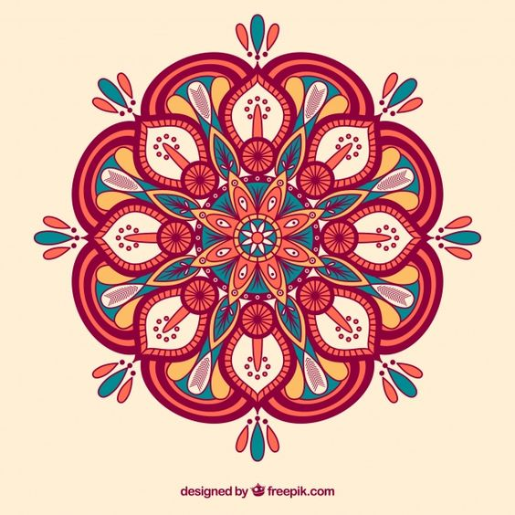
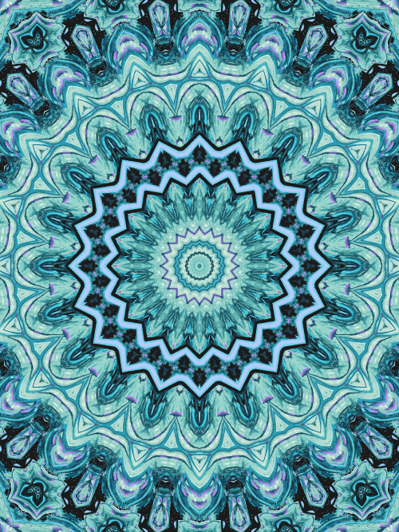
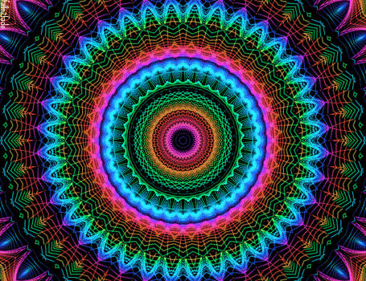

# ybai0703_9103_5

## Part 1: Imaging Technique Inspiration
### 1-1.Explanation of my inspiration
The complex geometry and multi-layered symmetrical patterns of mandalas can add depth and beauty to my visuals. I think it is very suitable for using computer technology to dynamically generate these patterns. Also, I want to make it an infinite animation.

### 1-2.examples I  found

[a GIF of kaleidoscope](readmeImages/kaleidoscope.gif)
[Link Text](https://www.youtube.com/watch?v=fFyC68CIEio)

## Part 2: Coding Technique Exploration
### 2-1. Explanation of why I chose these codes
With the first code example, I can let the user create a visual of a kaleidoscope in a canvas, then The second code can achieve the effect of zoom in effect (For details, please see the three GIF images in part 1). And the third one is a tutorial about how to create a mandala. For the assignment, I want to achieve the effect of combining code 1 and code 2.

### 2-2. example code
- [Link Text](https://p5js.org/examples/repetition-kaleidoscope/)
  - [an image of the example code1](readmeImages/example1.png)

- [Link Text](https://p5js.org/examples/3d-orbit-control/)
  - [an image of the example2 code2](readmeImages/example2-1.png)
  - [an image of the example2 code2](readmeImages/example2-2.png)

- [Link Text](https://www.youtube.com/watch?v=lz_aCw2Um3E)

